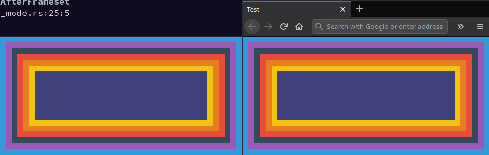
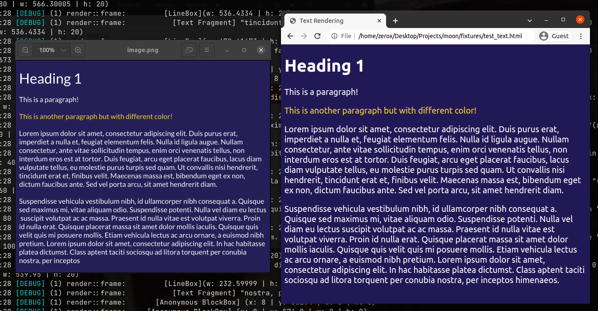

<h1 align="center">Moon</h1>

A hobby web browser developed from scratch

  
  

## What is this?

This is a web browser developed from scratch using Rust. I created this project to practice my Rust skills as well as to learn how the browser works.

To fit with the "make from scratch" spirit, I'll limit the use of external libraries as much as possible.

## Current status

Currently, the browser is able to render block & inline layout! I'm working on supporting other types of layout & better text-rendering. Here's a comparison with Firefox rendering. (Moon is on the left, Firefox is on the right).

## Wanna try it out?

Here are the steps to try it out if you are interested:

1. Clone the repository.
2. Run `cargo make example` and wait for the code to compile & execute.
3. Open `image.png` to see the output.

Refer to the [Makefile.toml](Makefile.toml) file for more info.

**Requirement:** Please refer to the proper Dockerfile in [`/docker`](/docker) for more information.

**Tested on:** Ubuntu 18.04

## Features

Bold text is what I'm working on

- [x] :electric_plug: DOM API
- [x] :memo: HTML Parsing
  - [x] HTML tokenizer
  - [x] HTML dom tree builder (85% specs)
- [x] :electric_plug: CSSOM API
- [x] :memo: CSS Parsing
  - [x] CSS tokenizer
  - [x] CSSOM parser/tree builder
- [x] :triangular_ruler: Style
  - [x] CSS cascade
  - [x] Style computation
  - [x] Render tree
  - [x] Selector matching
- [x] :flower_playing_cards: Layout process
  - [x] Box model
  - [x] Box tree generation
  - [x] Line fragmentation
  - [x] Layouts
    - [x] Flow (Block and inline)
    - [ ] Flex
    - [ ] Grid
- [x] :art: Rendering
  - [x] Display list
  - [x] GPU rendering
  - [x] Text rendering
- [ ] :earth_americas: **Networking**
  - [x] URL parsing
  - [ ] DNS resolving
  - [ ] DNS caching
  - [ ] HTTP/HTTPS
- [ ] :framed_picture: Media
  - [ ] :framed_picture: Image rendering
    - [ ] JPG
    - [ ] PNG
    - [ ] GIF
  - [ ] :clapper: Video playing
    - [ ] MP4
    - [ ] WebM
  - [ ] :speaker: Audio playing
    - [ ] MP3
    - [ ] WAV
- [ ] JavaScript

## Blog posts

I write about what I learn from this journey on my blog (order by latest):

### Browser from Scratch: Layout

A quick look into how the browser layout process works. - [**Read more**][5]

### Browser from Scratch: CSS parsing & processing

A brief history of CSS & how browser process CSS values - [**Read more**][4]

### Browser from Scratch: HTML parsing

Since I have foolishly made a promise with the first three words in the name of this series, let's build an HTML parser from scratch. - [**Read more**][3]

### Browser from Scratch: DOM API

One of the main building blocks of the HTML rendering process is the DOM API. Before a browser can render the HTML document, it needs to parse the document content into a tree structure called the DOM tree. In this post, I'll break down my experimentation in building a DOM API with Rust. - [**Read more**][2]

### Browser from Scratch: Introduction

This is the start of Browser from Scratch series, created to help me (and probably you too) to learn more about how a browser works by building one! - [**Read more**][1]

## Author

- [Viet Hung Nguyen](https://github.com/ZeroX-DG)

## License

- [MIT](LICENSE)

[1]: https://zerox-dg.github.io/blog/2020/05/29/Browser-from-Scratch-Introduction/
[2]: https://zerox-dg.github.io/blog/2020/09/01/Browser-from-Scratch-DOM-API/
[3]: https://zerox-dg.github.io/blog/2020/10/24/Browser-from-Scratch-HTML-parsing/
[4]: https://zerox-dg.github.io/blog/2021/01/13/Browser-from-Scratch-CSS-parsing-processing/
[5]: https://zerox-dg.github.io/blog/2021/09/26/Browser-from-Scratch-Layout/
