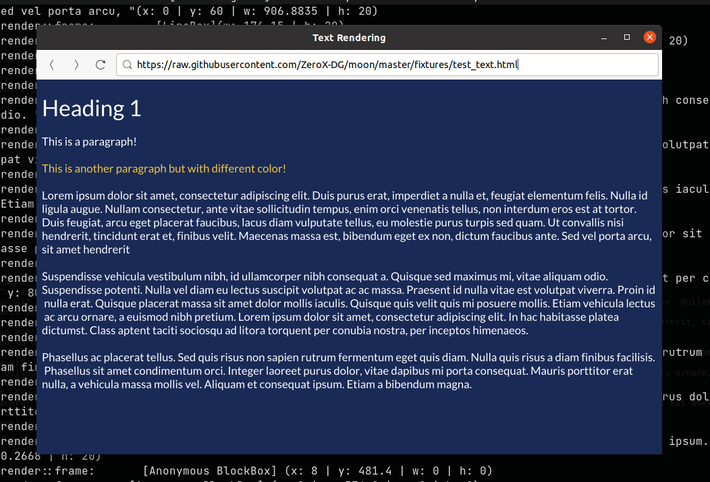
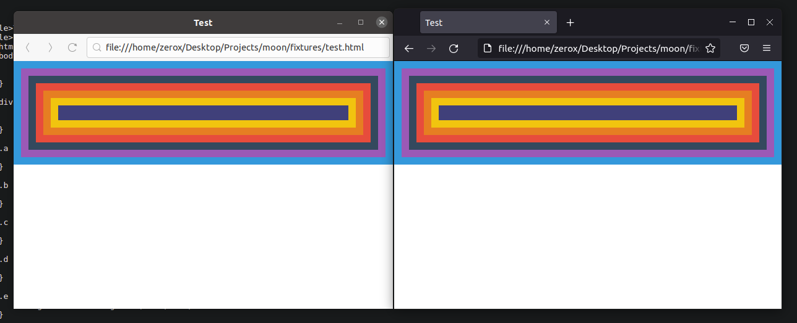

<h1 align="center">Moon</h1>

A hobby web browser developed from scratch

  
  

## What is this?

This is a web browser developed from scratch using Rust. To fit with the "make from scratch" spirit, the development of the browser avoids the use of external libraries as much as possible.

## Wanna try it out?

Here are the steps to try it out if you are interested:

1. Clone the repository.
2. Run `cargo run` and wait for the code to compile & execute.

Check out the [Getting Started Guide](./documentation/getting-started.md) for more advanced stuff.

## Screenshots

  

  
  <em>Rendering comparison between Moon & Firefox</em>

## Features

- **HTML:** Spec-compliant HTML tokenizer, parser & DOM tree builder.
- **CSS:** Spec-compliant CSS tokenizer, parser & CSSOM tree builder.
- **Style processing:** Style cascading, style value computation, selector matching & render tree construction.
- **Layout:** Flow layout (Block & Inline).
- **Rendering:** GPU rendering & text rendering.
- **Networking:** Spec-compliant URL parser.
- **User Interface:** GTK-based browser UI.

## Blog posts

I write about what I learn from this journey on my blog (order by latest):

- **Browser from Scratch: Layout** - [Read more][5]
- **Browser from Scratch: CSS parsing & processing** - [Read more][4]
- **Browser from Scratch: HTML parsing** - [Read more][3]
- **Browser from Scratch: DOM API** - [Read more][2]
- **Browser from Scratch: Introduction** - [Read more][1]

## Author

- [Viet Hung Nguyen](https://github.com/ZeroX-DG)

## License

- [MIT](LICENSE)

[1]: https://zerox-dg.github.io/blog/2020/05/29/Browser-from-Scratch-Introduction/
[2]: https://zerox-dg.github.io/blog/2020/09/01/Browser-from-Scratch-DOM-API/
[3]: https://zerox-dg.github.io/blog/2020/10/24/Browser-from-Scratch-HTML-parsing/
[4]: https://zerox-dg.github.io/blog/2021/01/13/Browser-from-Scratch-CSS-parsing-processing/
[5]: https://zerox-dg.github.io/blog/2021/09/26/Browser-from-Scratch-Layout/
